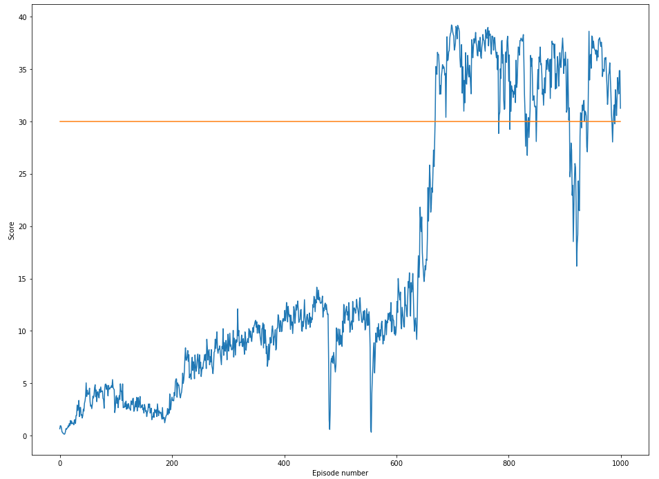
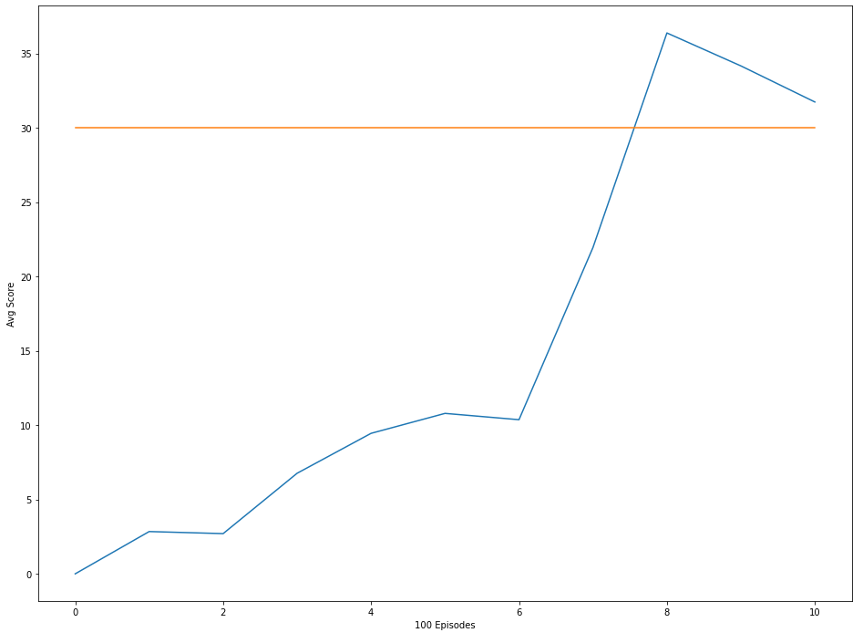

# Introduction

Goal of this project was to train an agent to handle an arm with two joints to reach for a given position. It should run until it reached a terminal state and score as high as possible. The agent always get's a possitive score when the end of the arm is in the the given target area.

# The Agent

The agent used in the project is a ddpg (Deep Deterministic Policy Gradient) agent with experience replay. The agent is splited in 2 neueral networks an actor and a critic. The actor is used to approximate the best action in the given state. While the critic will approximate the Q-value for the given state and action. Both of them are using soft updates weighted by the factor tau like in Fixed Q-Targets to avoid correlations.
During each step the current state is given to the actor network to determine the 'best' action which is then given to the environment. The resulting SARS' tuple is added to the experience replay and after that a batch of experiences is sampled to train the critic with the TD estimate and using the critic to train the actor.

Both networks consists of an input layer, 2 hidden layers (256 and 128) and an output layer. The Critic network also contains a batch normalization layer and a dropout layer to stabilize the learning process. To keep the actor exploring noise (Ornstein-Uhlenbeck process) is added to the choosen action.

# Hyperparameters

The agent was highly unstable at training, either it didn't learn above an average score of 3-5 at all (propably extremly slow learning) or droped back to this level after some promising averages of up to 24. The changes that resulted in the best improvements was increasing the size of the experience memory and reduced the noise added to the action. So after many different runs, sometimes good sometimes bad with the same hyperparameters i've choosen the following parameters

| Name | Value | Description |
|---|---:|---|
| TAU | 0.001 | factor for updating the target networks 
| LR_CRITIC | 0.0001 | learing rate of the critic
| LR_ACTOR | 0.0001 | learning rate of the actor
| GAMMA | 0.99 | discount factor
| BUFFER_SIZE | 400000 | size of the experince replay buffer
| BATCH_SIZE | 256 | amount of memory entries that are taken for each learn step
| sigma | 0.1 |
| mu  | 0.0 |
| theta | 0.15 |

# Solving the Environment

The configuration mentioned above solved the environment in episode 735. It started slow, but steady until in episode 657 where the score increased drastically.

# Future improvements

Overall i would try to experiment further with the hyperparameters to maybe get more stable results over multiple runs. Also it increased the time per episode an increased size of the hidden layers might be worth some tests.
I also thought of replacing the current experience replay with a proritized experience replay to improve performance.
And finally i woul like to try to implement a A2C to solve this environment.